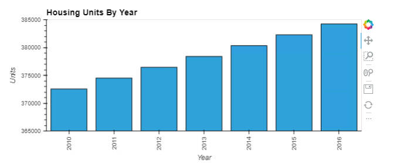
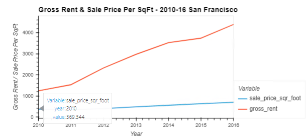
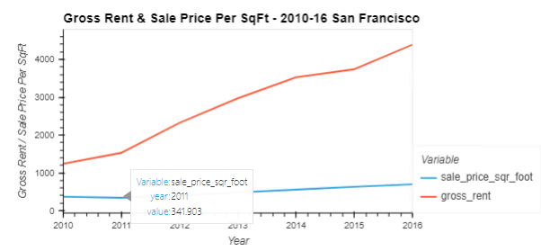
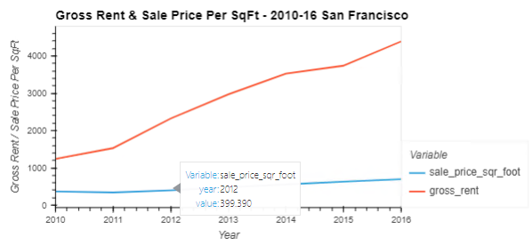

# Module 6 - PyViz Data Visualisation

This is the page for the sixth module of the Fintech Bootcamp course, covering PyViz Data Visualisation.

This page is a continuation of my GitHub learning structure for this course.

## Modules Notes

Above you will see the *^*.ipynb file for this homework.

There is also an img folder with screenshots I've taken from the output of the challenge.

# Challenge - Analysis of San Francisco Housing from 2010 to 2016

## Contents

* [Housing Units By Year](#housing-units-by-year-2010-2016)
* [Housing Units By Year](#housing-units-by-year-2010-2016)
* [Back to Fintech Home](#back-to-fintech-home)

## Housing Units By Year (2010-2016)

* __*What is the overall trend in housing units over the period being analysed*__

There was a gradual upward trend year on year during the period as shown below:

* __*Did any year experience a drop in the average sale price per square foot compared to the previous year?*__

2011 dropped below 2010 prices before rebounding in 2012:

## Back to Fintech Home

* [Fintech Bootcamp Home](https://github.com/d4np3/fintech-home)