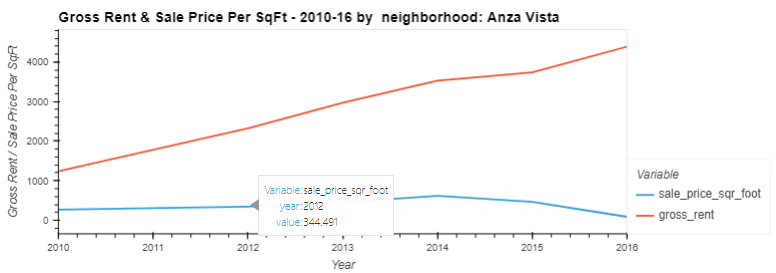
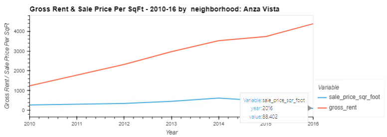
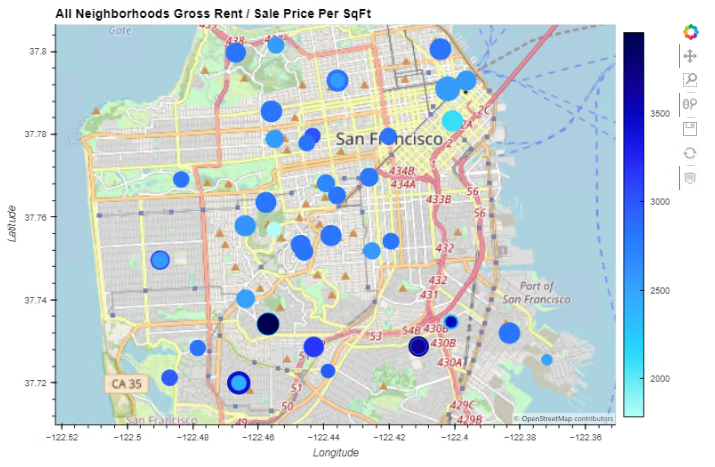
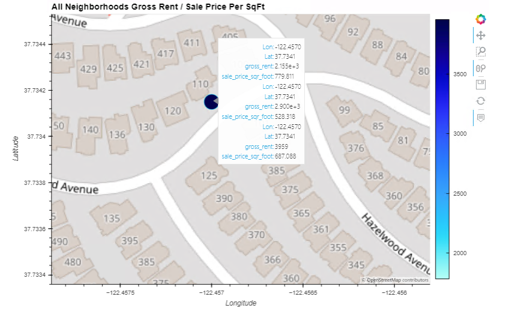
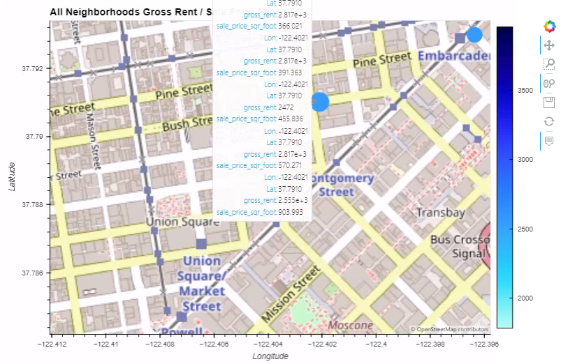
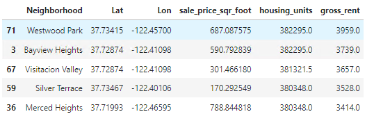
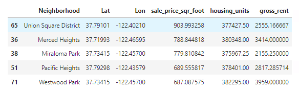
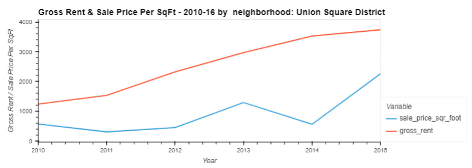
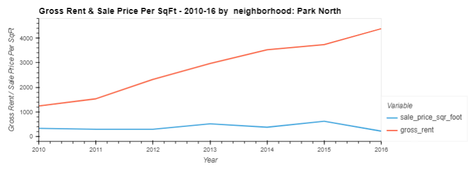

# Module 6 - PyViz Data Visualisation

This is the page for the sixth module of the Fintech Bootcamp course, covering PyViz Data Visualisation.

This page is a continuation of my GitHub learning structure for this course.

## Modules Notes

Above you will see the *^*.ipynb file for this homework.

There is also an img folder with screenshots I've taken from the output of the challenge.

Below I have compiled my assessment of the analysis, with those images, to support my notebook code for the challenge.

# Challenge - Analysis of San Francisco Housing: 2010-2016

## Contents

* [Housing Units By Year](#housing-units-by-year-2010-2016)
* [Sale Price Per Square Foot](#sale-price-per-square-foot-2010-2016)
* [Anza Vista Sale Price Comparison](#anza-vista-sale-price-comparison)
* [Highest Gross Rent and Sales Price](#highest-gross-rent-and-sales-price)
* [Rental Income and Sales Price Trend Comparison](#rental-income-and-sales-price-trend-comparison)
* [Opportunistic Neighborhoods](#opportunistic-neighborhoods)
* [Back to Fintech Home](#back-to-fintech-home)

## Housing Units By Year (2010-2016)

* __*What is the overall trend in housing units over the period being analysed*__

There was a gradual upward trend year on year during the period as shown below:

## Sale Price Per Square Foot (2010-2016)

* __*Did any year experience a drop in the average sale price per square foot compared to the previous year?*__

2011 dropped below 2010 prices before rebounding in 2012 as shown below:

Average Sale Price 2010 
 

Average Sale Price 2011 
 

Average Sale Price 2012 
 

## Anza Vista Sale Price Comparison

* __*For the Anza Vista neighborhood, is the average sale price per square foot for 2016 more or less than the price that’s listed for 2012?*__

It was considerably lower in 2016 compared to 2012 as shown below:

Anza Vista Average Sale Price 2012 
 

Anza Vista Average Sale Price 2016 
 

## Highest Gross Rent and Sales Price

* __*Which neighborhood has the highest gross rent, and which has the highest sale price per square foot?*__

Collectively, using the interactive map, it is difficult to locate the values to answer the questions. 

Averages of Gross Rent and Sale Price Plotted on Map 
 

However, after some hunting, I did locate them as shown below!

Highest Gross Rent via Map (Westwood Park) 
 

Highest Sale Price via Map (Union Square District) 
 

However relying on the map colours alone is misleading. One could say that potentially Mount Davidson region has the highest of both with the colour coding shown. Yet when zooming in closely and reviewing the figures it is clearer to see more specific details. 

You can back this up by reviewing the data in the dataframe itself and ordering on the two values in question. You see the highest Gross Rent was Westwood Park and the highest sale per square foot was Union Square District.

Highest Gross Rent via DataFrame (Westwood Park) 
 

Highest Sale Price via DataFrame (Union Square District) 
 

## Rental Income and Sales Price Trend Comparison

* __*How does the trend in rental income growth compare to the trend in sales prices? Does this same trend hold true for all the neighborhoods across San Francisco?*__

For the most part, the rental income growth is considerably steeper climb than the sale price growth. Many sales prices have remained constant, slow growth or even reduced in value. There is the odd exception such as Union Square however.

Union Square Bucks The Sale Price Trend 
 

## Opportunistic Neighborhoods

* __*What insights can you share with your company about the potential one-click, buy-and-rent strategy that they're pursuing? Do neighborhoods exist that you would suggest for investment, and why?*__

There are some neighborhoods that are selling for less in 2016 than they were in 2012, such as Anza Vista (shown above) and Park North (below), meanwhile the rent has continued to rise. Many neighborhoods haven't had much growth at all. So I would say there are plenty of good rental yield locations if they can afford to buy properties such as this with a downward Sale Price trend.

Buy Options 
 

## Back to Fintech Home

* [Fintech Bootcamp Home](https://github.com/d4np3/fintech-home)